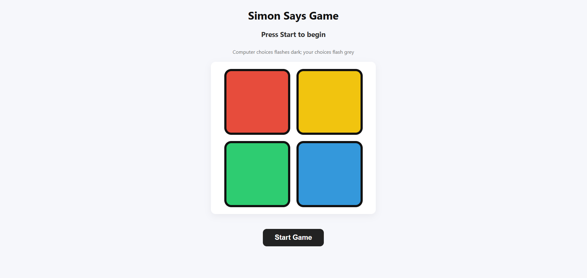

# Simon Says Game

A simple Simon Says memory game built using HTML, CSS, and JavaScript.

## 📸 Screenshot



## 🎮 How to Play

1. Press any key to start the game.
2. Watch the color sequence carefully.
3. Click the buttons in the same order.
4. Each level adds one more color to the sequence.
5. If you click the wrong color, the game is over.

## 🛠️ Technologies Used

- HTML
- CSS
- JavaScript

## ✨ Features

- Random color sequence
- Increasing difficulty
- Button animations
- Score/level tracking
- Game-over detection
- Restart functionality

## Installation

Clone the repository and open `index.html` in your browser.

## 📂 Project Structure

```text
SimonSaysGame/
├── index.html
├── style.css
├── script.js
├── SimonSaysGame.png
└── README.md
```

## 👨‍💻 Author

Saiteja
